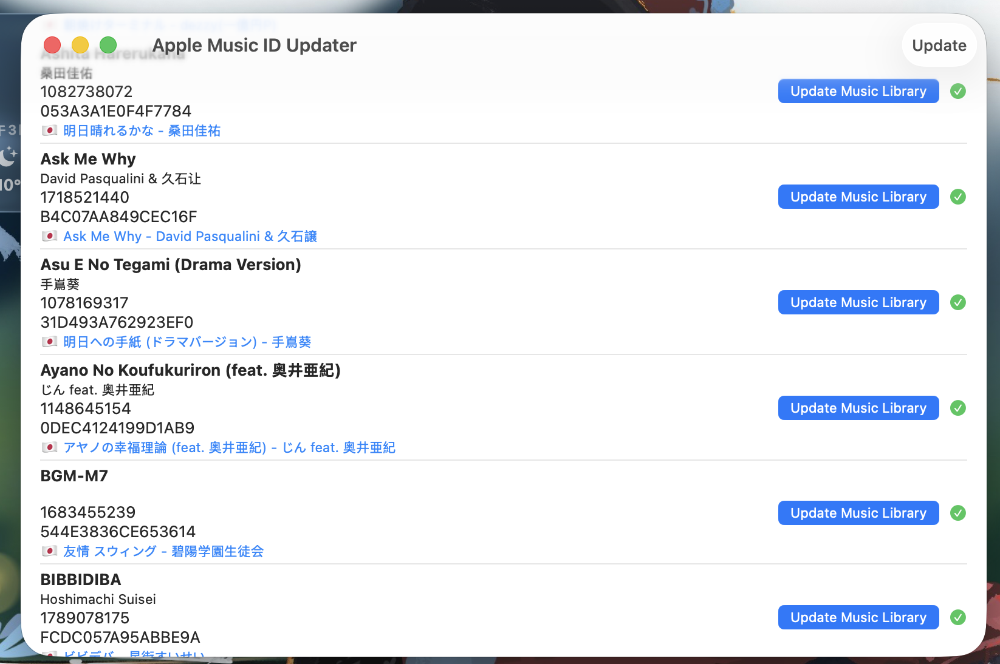

# Apple Music JP Name Fix

Fix the Japanese Name in non-JP Apple Music Store.

## How it works:

* Read the local music library with [MusicKit](https://developer.apple.com/musickit/)
* Search the catalog ID in the JP iTunes Store with iTunes Search API.
* Update the local music library with AppleScript. (Seems to be no other options.) 
